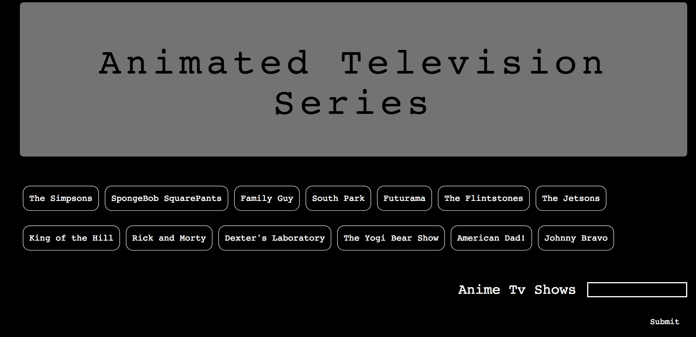

# Giphy

<h3>This app displays buttons related to a certain topic and allows you to add search terms to generate additional buttons that when clicked, accesses the GIPHY API and generates 25 static GIPHY images. Click on an image to pause or play the GIF.</h3>

 

 
<strong>Requirements</strong>
 

<strong>The app takes the entered search term topics from a user input box and pushes them into array from which it creates buttons in the HTML. Clicking on a button grabs 25 static, non-animated gif images from the GIPHY API and places them on the page.</strong>
 

<li>	When the user clicks one of the still GIPHY images, the gif should animate. •	If the user clicks the gif again, it should stop playing. •	With every gif is displayed its rating (PG, G, etc.).</li>
 
<strong>Technologies Used</strong>
 

<li>	HTML •	CSS •	Bootstrap •	JavaScript to make the page dynamic •	jQuery for Dom Manipulation •	AJAX for API GET requests.</li> 
